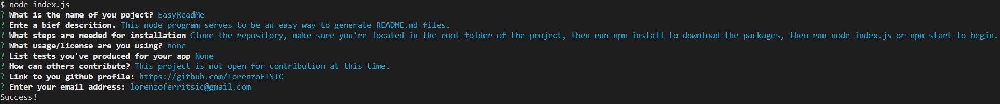

  # EasyReadMe
  
  ## Table of Contents
  1. [Description](#description)
  2. [Installation](#installation)
  3. [License](#license)
  4. [Tests](#tests)
  5. [Contributing](#contributing)
  5. [Github](#github)
  6. [Email](#email)
  ## Description
  This node program serves to be an easy way to generate README.md files.
  ## Installation
  Clone the repository, make sure you're located in the root folder of the project, then run npm install to download the packages, then run node index.js or npm start to begin.
  ## License
  
  ## Contributing
  This project is not open for contribution at this time.
  ## Tests
  None
  ## Github 
  https://github.com/LorenzoFTSIC
  ## Email
  lorenzoferritsic@gmail.com

  